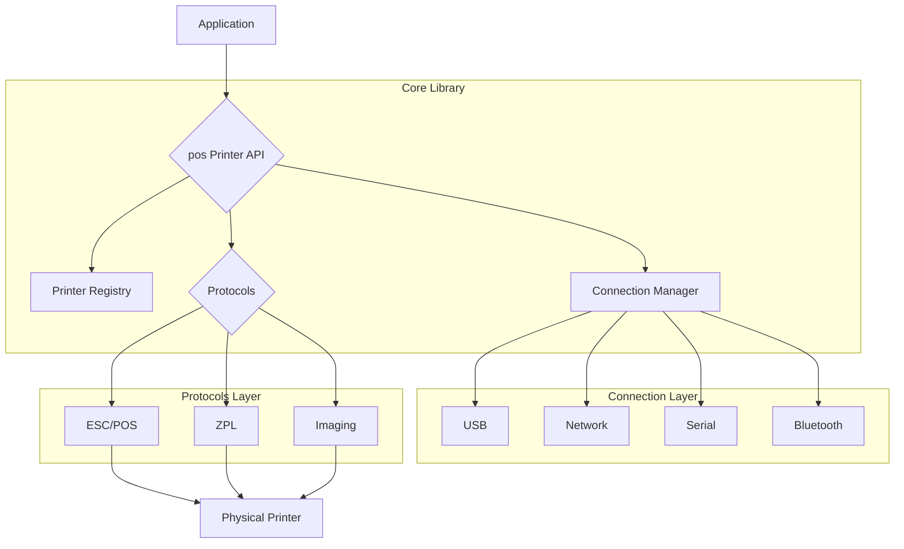

# POS Printer: A Modular Go Library for Thermal Printers

<div align="center">


[](https://goreportcard.com/report/github.com/adcondev/pos-printer)
[](https://opensource.org/licenses/MIT)
[](https://pkg.go.dev/github.com/adcondev/pos-printer)
[](https://github.com/avelino/awesome-go)
[](https://go.dev/)
[](https://github.com/adcondev/pos-printer/releases)
[](https://codecov.io/gh/adcondev/pos-printer)
[](https://github.com/adcondev/pos-printer/pkgs/container/pos-printer)


<br>


**A modular, extensible library for thermal printer communication across multiple protocols**

</div>

## 📝 Table of Contents

- [Overview](#-overview)
- [Key-Features](#-key-features)
- [Architecture-Diagram](#️-architecture-diagram)
- [Installation](#-installation)
- [Usage-Example](#-usage-example)
- [Supported-Protocols](#️-supported-protocols)
- [Roadmap](#-roadmap)
- [Contributing](#-contributing)
- [DevOps-and-CI/CD](#-devops-and-cicd)
- [License](#-license)

## 📝 Overview

**POS Printer** is a Go library that provides a unified, developer-friendly interface for communicating with a wide range of POS (Point of Sale) printer models. Designed with a clean and modular architecture, it simplifies the process of sending commands to thermal printers, whether you need to print text, generate QR codes, or render images. With comprehensive test coverage and support for multiple connection types, this library is built for reliability in production environments.

## ✨ Key Features

- **Multi-Protocol Support**: Native support for **ESC/POS** and **ZPL**, with an extensible architecture to add more.
- **Flexible Connection Options**: Connect to printers via **Serial**, **USB**, **Network (TCP/IP)**, or **Bluetooth**.
- **Protocol-Agnostic Image Printing**: A powerful imaging package that handles direct bitmap generation from image files.
- **Centralized Printer Registry**: Manage multiple printer configurations in a centralized system, making it easy to switch between devices.
- **Comprehensive Testing**: Includes a full suite of unit tests, mocks, and fakes to ensure stable and predictable behavior.
- **Well-Documented and Idiomatic Go**: Clean, commented code that follows modern Go best practices.

## 🏗️ Architecture Diagram

The library is designed with a decoupled architecture, where each core functionality is separated into its own package. This allows for easy extension and maintenance.



## 🚀 Installation

To get started, add the library to your Go project using `go get`:

```bash
go get github.com/adcondev/pos-printer
```

## 💡 Usage Example

Here’s a simple example of how to connect to a printer and print a "Hello, World!" message.

```go
package main

import (
	"log"

	"github.com/adcondev/pos-printer/escpos"
	"github.com/adcondev/pos-printer/pos"
)

func main() {
	// 1. Create a new printer profile in the registry
	registry := pos.NewPrinterRegistry()
	printerProfile := &pos.Printer{
		Name: "MyReceiptPrinter",
		Device: &pos.Device{
			Connector: &pos.NetworkConnector{Address: "192.168.1.100:9100"},
		},
	}
	registry.Add("my_printer", printerProfile)

	// 2. Get the printer from the registry
	p, err := registry.Get("my_printer")
	if err != nil {
		log.Fatalf("Failed to get printer: %v", err)
	}

	// 3. Connect to the printer
	if err := p.Connect(); err != nil {
		log.Fatalf("Failed to connect: %v", err)
	}
	defer p.Close()

	// 4. Send a command
	cmd := escpos.NewPrinter(p.Device.Connector)
	if err := cmd.Print("Hello, World!\n"); err != nil {
		log.Fatalf("Failed to print: %v", err)
	}

	log.Println("Successfully printed!")
}
```

## 🖨️ Supported Protocols

| Protocol | Status         | Description                                    |
|----------|----------------|------------------------------------------------|
| ESC/POS  | ✅ Stable       | Epson Standard Code for Point of Sale Printers |
| ZPL      | 🔄 In Progress | Zebra Programming Language for label printers  |
| Image    | ✅ Stable       | Direct bitmap generation for any printer       |

## 🗺️ Roadmap

- [ ] Full support for the ZPL protocol.
- [ ] Add support for Bluetooth connections.
- [ ] Implement a more advanced logging system.
- [ ] Create a web-based interface for managing printers.

## 🤝 Contributing

Contributions are welcome! If you'd like to help improve the library, please feel free to fork the repository, make your changes, and submit a pull request. For major changes, please open an issue first to discuss what you would like to change.

1.  **Fork** the repository.
2.  Create your feature branch (`git checkout -b feature/AmazingFeature`).
3.  Commit your changes (`git commit -m 'Add some AmazingFeature'`).
4.  Push to the branch (`git push origin feature/AmazingFeature`).
5.  Open a **Pull Request**.

## 🚀 DevOps and CI/CD

This project is built with a strong focus on automation, code quality, and a streamlined development process. The following is a summary of the DevOps and CI/CD infrastructure:

### CI/CD Pipeline

The CI/CD pipeline is built on **GitHub Actions** and is designed to ensure code quality, security, and compatibility. The pipeline consists of the following jobs:

*   **Validate Commits:** Enforces conventional commit messages and semantic pull request titles to maintain a clean and readable project history.
*   **Test and Coverage:** Runs the full suite of Go tests on Ubuntu, Windows, and macOS to ensure cross-platform compatibility. Code coverage reports are uploaded to **Codecov** to monitor code quality.
*   **Benchmarks:** Runs and reports benchmarks on every pull request to monitor performance and prevent regressions.
*   **Security Scan:** Performs a security scan using **Trivy** to identify and report vulnerabilities. The results are uploaded to the GitHub Security tab for easy tracking.
*   **Go Linters:** Runs `golangci-lint` to enforce coding standards and best practices.

### Automated Release Management

The project uses an automated release process that triggers on merges to the `main` branch. The process is as follows:

1.  **Analyze Commits:** The pipeline analyzes the commit messages since the last release to determine the next semantic version (major, minor, or patch).
2.  **Generate Release Notes:** A new `CHANGELOG.md` is generated based on the commit messages.
3.  **Create GitHub Release:** A new GitHub release is created with the new version and release notes.
4.  **Warm up Go Proxy:** The Go module proxy is notified of the new version to ensure it is available to developers as quickly as possible.

### Code Quality and Governance

The project uses a combination of tools to enforce code quality and governance:

*   **`golangci-lint`:** A fast and comprehensive Go linter that checks for a wide range of issues.
*   **`pre-commit` hooks:** A set of hooks that run before each commit to format code, run tests, and check for common issues.
*   **`commitlint`:** Enforces conventional commit messages to ensure a clean and readable project history.

## 📄 License

This project is licensed under the MIT License - see the [LICENSE](LICENSE) file for details.

---

<div align="center">
  <sub>Built with ❤️ by adcondev</sub>
</div>
